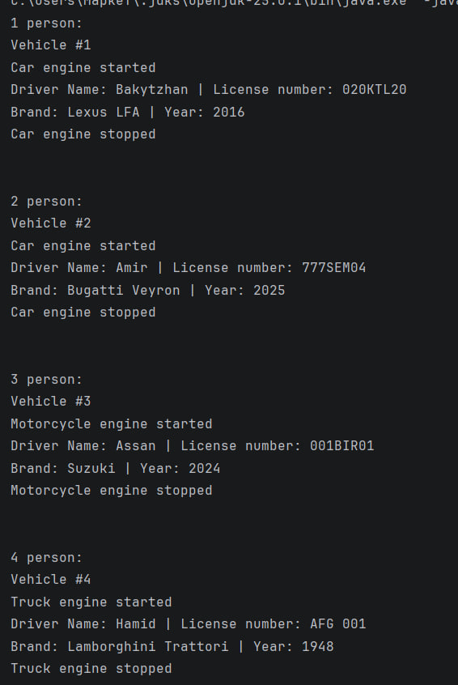

A. Project Overview

The Vehicle Management System was developed to manage vehicle-related information in an organized and structured way. The main purpose of this system is to allow users to create, modify, and manage vehicle data efficiently.

Inheritance was used to enable subclasses to reuse and extend the functionality of the superclass, which helped reduce code duplication and improve maintainability. Composition was applied to establish a strong relationship between vehicles and their drivers. Abstraction allowed the system to define general vehicle behavior while leaving specific implementations to individual vehicle types.

B. Class Hierarchy

A superclass defines the common attributes and behaviors that are shared among all related classes. Subclasses inherit these properties from the superclass and may extend or customize them according to their specific requirements.

Method overriding allows subclasses to modify or enhance the behavior of methods inherited from the superclass, providing more specialized functionality. The project makes use of three access modifiers:

Private — accessible only within the defining class.

Public — accessible from any class.

Protected — accessible within the same package and by subclasses.

C. Instructions to Compile and Run
javac *.java
java Main

D.

E. Reflection Section

Inheritance played an important role in establishing a clear superclass–subclass relationship, which helped create a clean and well-structured codebase. It allowed common logic to be shared across multiple classes, improving code reusability.

Although method overriding was not heavily customized in this project, it provides the flexibility to redefine methods such as startEngine() and stopEngine() for different vehicle types. One challenge encountered was understanding how changes made in a subclass can affect inherited members of the superclass, which highlighted the importance of proper access control and encapsulation.
